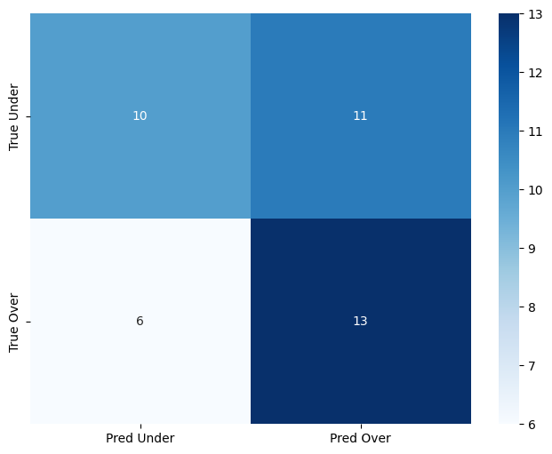

# ID2223-Final-Project: Football Betting
### Authors: Andreas Levander, Simon Granström

[Public URL](https://huggingface.co/spaces/lab2-as/Project)

## Problem Description
We will create a football betting bot for Premier League. The bot will try to predict if the upcoming football match will result in over or under 2.5 goals.

## Tools
We chose to use a simple XGBoost Classifier as our model in order to focus more on learning the different pipelines and feature engineering as supposed to experimenting with different machine learning models. 

As a feature store and model registry we used Hopsworks.

For model training and inference we used Modal as the compute platform.

We chose to use [Huggingface](https://huggingface.co/) with [Gradio](https://www.gradio.app/) for our UI since we were already familiar with it from the previous assigment.

## Data
We chose to focus on Premier League only as this is one of the most popular leagues.

We used historical data and update the data daily from [football-data.co.uk](https://www.football-data.co.uk/downloadm.php). The dataset is in the form of an Excel spreadsheet. This dataset includes information such as full- and halftime results, home and away shots, full- and halftime home/away goals, odds and more. This data can be collected using simple get requests. 

For the inference data, upcoming matches, we tried to use the API [api-football](https://www.api-football.com/). But we found out that data for the current season was unavailable in the free tier so we swapped to [Sportsradar's API](https://developer.sportradar.com/) which had a 30 day free trial available.

## Method
The data ingestor downloads the data from [football-data.co.uk](https://www.football-data.co.uk/downloadm.php). This was done by sending a get request to the above url, finding the download link for the latest season (Season 2024/2025) and then downloading the excel file, storing it in memory. This excel file was then read using pandas and the sheet containing the Premier League results were parsed. We added one column for the over/under result and the total league over/under result percentages before the raw data was saved to Hopsworks as a feature group. Then using this data we created lag features which got saved to another feature group in Hopsworks. The following lag features were created for each game:
* Lags for home team:
    * Number of shots taken when playing home
    * Shots on target when playing home
    * Full time goals when playing home
    * Half time goals when playing home
* Lags for away team:
    * Number of shots taken when playing away
    * Shots on target when playing away
    * Full time goals when playing away
    * Half time goals when playing away

Where the lag features are vectors containing values from the last four games. This parser was then deployed on modal, running every day at 1 am.

The model trainer first creates a feature view using the following features (including lag features):
* Home/Draw/Away odds
* Over-/Under 2.5 goals odds
* League over/under percentage

This feature view was then used to create a test-train split using 20% of the data for the test set. 
The data split was then used to train an XGBoost Classifier, calculate validation metrics (confusion matrix and F1 score) and then uploaded to the Hopsworks model registry. The model trainer is deployed on Modal, training the model every monday at 2 am. 
    
For inference we fetched daily data from SportsRadar's API which contains games that are going to be played that day and their odds for Home/Draw/Away and Over/Under 2.5 Goals. The endpoint chosen had every soccer game played that day so it required some filtering to extract our required data. Then we joined this data with the latest league over/under percentage from hopsworks as well as each teams latest lag features. The model with the best F1 score got downloaded from the Hopsworks model registry and used to predict these upcoming games. Then the predictions alongside the input vectors gets uploaded to a prediction feature group in Hopsworks. This inference procedure got deployed on Modal, running every day at 3 am.

For UI we fetch data from Hopsworks feature groups and display it using Gradio components. This includes Todays' Games with predicitons, Upcoming games, abd Last 10 games with our prediciton including the actual result. We also calculate and show Return on Investment metrics for our model.

## Results
We managed to successfully implement all the serverless pipelines as individual components with minimal dependecies between them. This resulted in a robust stand-alone serverless ML system which is able to somewhat decently predict the outcome of football matches. Our trained model recieved an F1 score of 0.5726 on the test set, the confusion matrix for this can be seen in below. From this we can see that the model manages to predict well for games that end up scoring over 2.5 goals (about 68% accuracy) while the predictions for under 2.5 goals could be better (about 52% accuracy). Even tho the accuracy is above 50% in both cases, this might not lead to profit because if the odds are below 2 the net profit would be negative at an accuracy of 50%.

 
     
    
Figure 1: Confusion matrix for trained XGBoost Classifier model

## How to run
Visit each components folder and read the `README.md` to find out how to run each component.